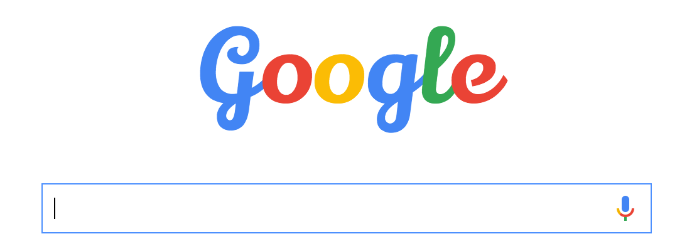

# google-logo-fonts.user.js
Switch Google's logo to random fonts from Google Fonts API.

(from https://www.google.com/?font=Lily%20Script%20One)

## Usage

First [install](#install). Then just open up https://google.com, and you'll see the logo change to a new font each time.

To see what font has loaded, and get a URL to share to it, see the "Google Logo Font" message in the console log.

Example share URL: https://www.google.com/?font=Lily%20Script%20One

## Install

### Chrome

#### TamperMonkey
1. Install [Tampermonkey] Chrome extension.
2. Open script URL in Chrome: https://github.com/AndersDJohnson/google-logo-fonts.user.js/raw/master/src/js/google-logo-fonts.user.js
3. Should see Tampermonkey page. Choose "Install" button.

#### Native

See [Chromium User Scripts]. Have not tested.

### Firefox

#### GreaseMonkey

See [GreaseMonkey]. Have not tested.

[Tampermonkey]: https://chrome.google.com/webstore/detail/tampermonkey/dhdgffkkebhmkfjojejmpbldmpobfkfo?hl=en
[Chromium User Scripts]: http://www.chromium.org/developers/design-documents/user-scripts
[GreaseMonkey]: http://www.greasespot.net/
